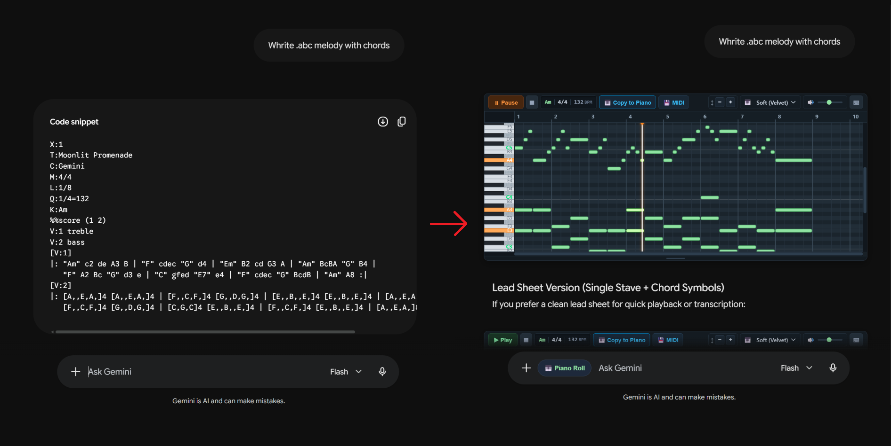
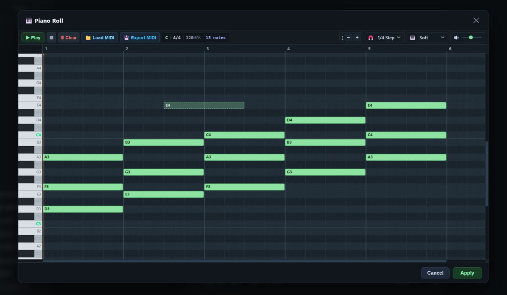

# Gemini ABC Piano Roll

Browser extension for Google Gemini and NotebookLM that renders ABC music notation as an interactive piano roll.

> [!TIP]
> **How to prompt Gemini:** Ask the model to output notes in ABC notation (for example: *"write a chord progression in ABC format"* or *"give me the melody in ABC notation"*). The extension detects ABC code blocks and renders them as interactive piano rolls automatically.

## Installation

1. Clone or download this repository to your computer.
2. Open `chrome://extensions` in any Chromium browser (Chrome, Brave, Edge, Opera).
3. Turn on "Developer mode" (toggle switch in the top right).
4. Click "Load unpacked" (button in the top left) and select this repository folder.

## Features

- In-chat playback: play ABC snippets generated by the model directly in the conversation.
- Visual piano roll: view note pitches, durations, and chords on a grid.
- Note editor: draw melodies, chords, or edit existing patterns.
- MIDI import/export: load .mid files into the editor or download generated patterns as MIDI.

## Supported Sites

- Gemini (gemini.google.com/app, gemini.google.com/spark)
- NotebookLM (notebooklm.google.com)

## Controls

- Space: Play / pause
- Scroll over keyboard: Vertical zoom
- Scroll over ruler: Horizontal zoom
- Left click: Add or move note
- Right click: Delete note
- Drag note edge: Resize note

